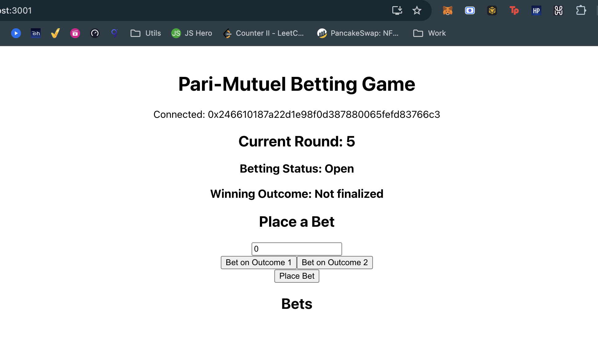
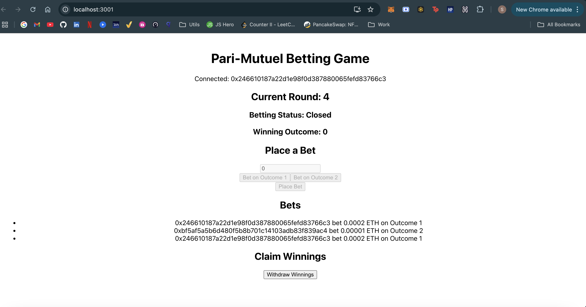
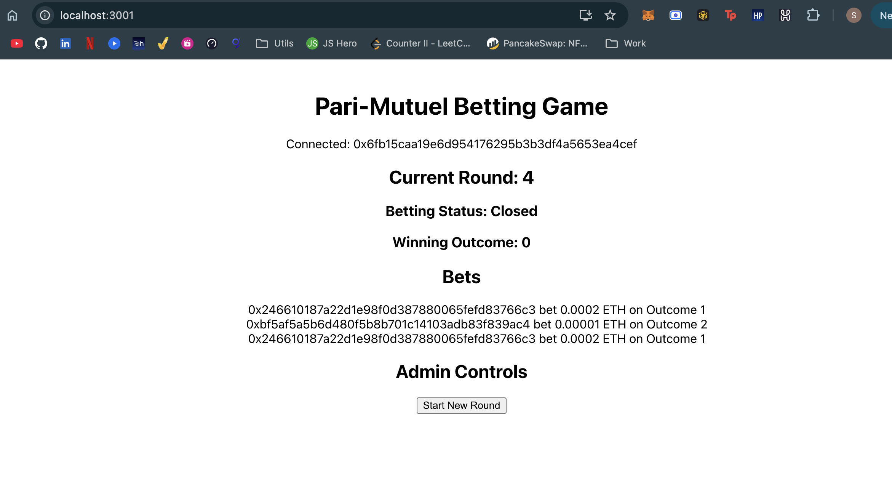
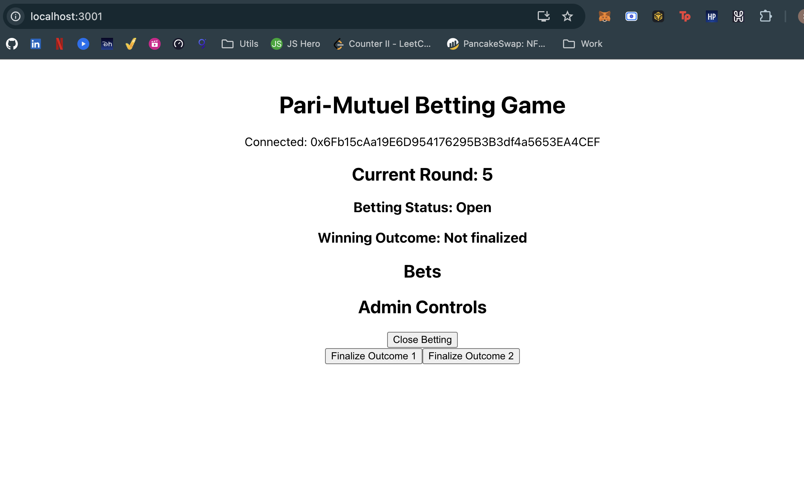
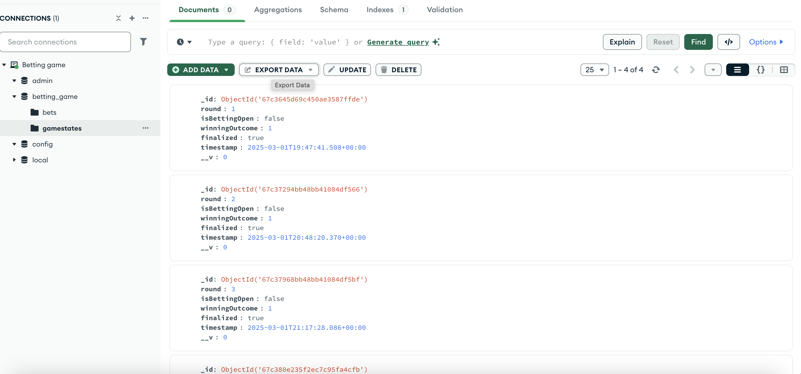
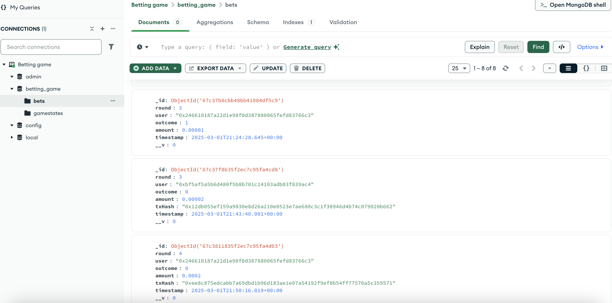

# Pari-mutuel-betting-game
Pari-mutuel betting game 

# Steps to compile and deploy the smart contract 
1. npm i (`node version 18`) 
2. npm run compile (to compile the contract)
3. npm run `deploy:testnet` to deploy the smart contract on testnet. (currently using binance)
4. npm run `deploy:mainnet` to deploy on mainnet. 

## Deployed smart contract on testnet: 
https://testnet.bscscan.com/address/0x9e11d2164642da0f6f475813f0aeef1a0e5dc210 

## Place bets

### `Withdraw rewards`

## Admin Panel 
 

### Close and finalize round 

## Database game stats 
 

### User bets 

